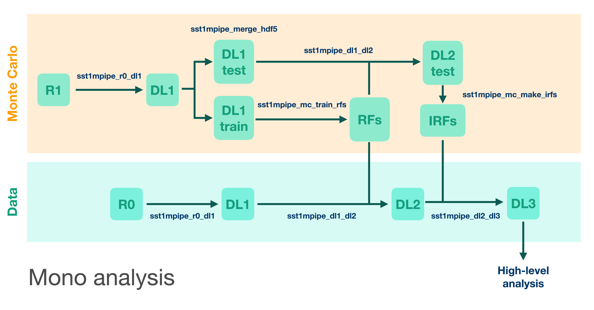
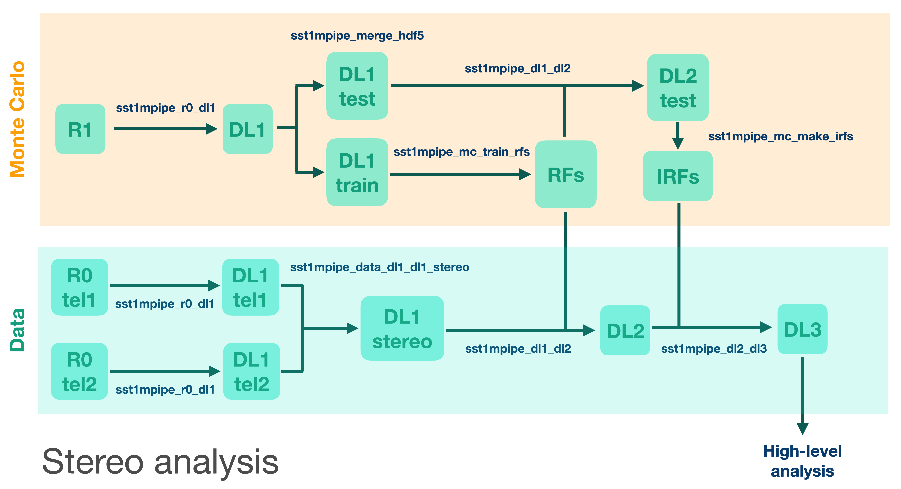

.. _introduction:

Introduction
============

Installation
------------

The advanced package and environment management system, `Anaconda <https://www.anaconda.com/distribution/#download-section>`_, `Miniconda <https://docs.conda.io/en/latest/miniconda.html>`_ or `Mamba <https://anaconda.org/conda-forge/mamba>`_, is needed to be installed first.

The Mamba is recomended due to some (quite often occured) stucks at solving environment on Anaconda. Up to now Mamba works well.

Set up environment based on Mamba 

.. note::

    For more details see https://github.com/conda-forge/miniforge#mambaforge

.. code-block:: console

    curl -L -O "https://github.com/conda-forge/miniforge/releases/latest/download/Mambaforge-$(uname)-$(uname -m).sh"
    bash Mambaforge-$(uname)-$(uname -m).sh

or

.. code-block:: console

    wget "https://github.com/conda-forge/miniforge/releases/latest/download/Mambaforge-$(uname)-$(uname -m).sh"
    bash Mambaforge-$(uname)-$(uname -m).sh

For users
~~~~~~~~~

- download stable version of **sst1mpipe** (latest version = 0.5.5)
- create and activate **conda** environment
- install **sst1mpipe**

.. code-block:: console

    SST1MPIPE_VER=0.5.5

    wget https://github.com/SST-1M-collaboration/sst1mpipe/archive/refs/tags/v$SST1MPIPE_VER.tar.gz
    tar -xvf v$SST1MPIPE_VER.tar.gz
    cd sst1mpipe-$SST1MPIPE_VER
    conda env create -n sst1m-$SST1MPIPE_VER -f environment.yml
    conda activate sst1m-$SST1MPIPE_VER
    pip install -e .

    rm environment.yml

For developers
~~~~~~~~~~~~~~

- download latest development version from git repository
- create and activate **conda** environment
- install **sst1mpipe**

.. code-block:: console

    git clone git@github.com:SST-1M-collaboration/sst1mpipe.git
    conda env create -f sst1mpipe/environment.yml
    conda activate sst1m-dev
    pip install -e sst1mpipe

Pre-installed conda environment on **Calculus**
~~~~~~~~~~~~~~~~~~~~~~~~~~~~~~~~~~~~~~~~~~~~~~~

If one prefers to work on **Calculus**, he/she may skip the pipeline installation completely and 
only activate preinstalled environment: 

.. code-block:: console

    source /data/work/analysis/software/mambaforge/etc/profile.d/conda.sh
    conda activate /data/work/analysis/software/mambaforge/envs/sst1m-$SST1MPIPE_VER

.. _analysis_basics:

Analysis basics
---------------

**sst1mpipe** takes the raw waveforms in each camera pixel, calibrates them into the number of photoelectrons, 
and reconstructs the physical parameters of primary gamma-ray photons such as their energy 
and arrival direction. It also classifies events to suppress hadronic background. Standard reconstruction is 
performed using Random Forest regressors and classifiers, which are pre-trained on precise Monte Carlo simulations.
**sst1mpipe** handles Monte Carlo and Random Forest training as well, and can be also used to estimate SST-1M
performance. The data analysis is performed in several subsequent steps, where each data level is stored, and so 
any possible future reprocessing can start from any point in the chain. The data levels used in **sst1mpipe** follow 
the **ctapipe** data model:

+-----------+---------------------------------------------------------------------------+-------------+
| Data Level| Description                                                               | File Format |
+===========+===========================================================================+=============+
| R0        | Raw waveforms in each pixel (uncalibrated),                               | ZFITS       |
+-----------+---------------------------------------------------------------------------+-------------+
| R1        | Calibrated waveforms (in photoelectrons, pedestal subtracted)             |             |
+-----------+---------------------------------------------------------------------------+-------------+
| DL1       | Integrated charge and peak position of the waveform in each pixel         | HDF5        |
|           | + Hillas parameters.                                                      |             |
+-----------+---------------------------------------------------------------------------+-------------+
| DL2       | Reconstructed event parameters (energy, direction, primary type)          | HDF5        |
+-----------+---------------------------------------------------------------------------+-------------+
| DL3       | Photon lists (after selection and gammaness cut)                          | FITS        |
|           | + Instrument Response Functions                                           |             |
+-----------+---------------------------------------------------------------------------+-------------+

Scheme of data/MC processing the pipeline:

For a detailed description of all analysis steps, see: :ref:`sst1m_analysis_workflow`.